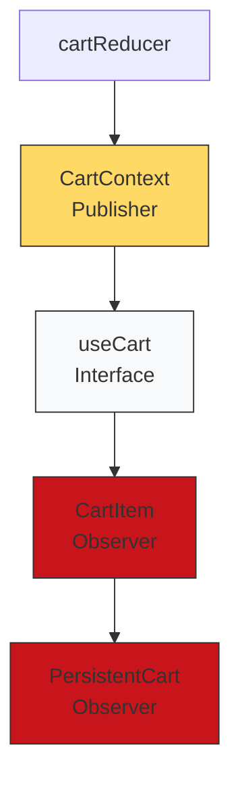

<div style="display: flex; gap: 10px; flex-wrap: wrap; align-items: center;">
  
  
  
</div>


# 🥪 Sanguches Xpress - Documentación Técnica
# 📚 Tech Stack 

### Frontend
- **React**: Biblioteca para construir interfaces de usuario
- **Framer Motion**: Manejo de animaciones
- **Axios**: Cliente HTTP para comunicación con la API
- **Tailwind CSS**: Framework de utilidades CSS para diseño moderno
- **Routing:** React Router v6, code Splitting y lazy loading
- **Animaciones:** Framer Motion
- **Axios**: Cliente HTTP para comunicación con la API
  - 
## Backend (Laravel)

 - Laravel 10
 - PHP 8+
 - MySQL
 - RESTful API

🏗️ Arquitectura del Sistema

## 🎯 Patrones de Diseño Implementados


## 1.🛒 Observer Pattern - Cart Implementation  ✅ 
Implementado para manejar actualizaciones del carrito en tiempo real y notificaciones. Este patrón es fundamental cuando necesitamos mantener sincronizados múltiples componentes con un estado central.


#### Flujo de Datos( Cuando ocurre un evento (ej: agregar al carrito)
 - **cartReducer**: procesa y notifica actualiza al el estado
 - **cartContext**: Mantiene el estado y notifica cambios
 -  **useCart**: proporciona métodos para interactuar con el estado, Los suscriptores reaccionan automáticamente por medio de un useEffect
-**(CartItem, PersistentCart)** - Reaccionan a los cambios

### Implementacion 
-  Subject/publisher **(CartContext y FiltersContext)**: Este mecanismo de suscripción y notificación está abstraído por React, lo que hace el código más limpio y mantenible en el contexto de una aplicación React moderna.
```bash 
//Publisher (CartContext.jsx) 
export const CartContext = createContext();

export const CartProvider = ({ children }) => {
  const [state, dispatch] = useReducer(cartReducer, initialState);
  // Infrastructure para suscriptores
  return (
    <CartContext.Provider value={{ state, dispatch }}>
      {children}
    </CartContext.Provider>
  );
};
```

- Subscriber/Interface **(useCart)** - La clase abstracta useCart actúa como un contrato que garantiza que todas las operaciones del carrito se implementen de manera consistente en toda la aplicación. Los suscriptores reaccionan automáticamente
```bash
export const useCart = () => {
  const { state, dispatch } = useContext(CartContext);
  // Métodos compartidos
  return {
    addToCart,
    removeFromCart,
    updateCartItem,
    // ...
  };
};
```
- Observers/Concrete Subscribers **(CartItem, PersistentCart)** - Es efectivamente un Observer concreto que Reacciona a las actualizaciones renderizando los nuevos datos
- **CartItem** : componente reutilizable que se suscribe a los cambios del estado del carrito y Maneja las interacciones locales (cantidad, eliminación)
```bash
const CartItem = React.memo(({ item }) => {
  const { updateCartItem } = useCart();
  
  useEffect(() => {
    // Reacción a cambios
  }, [item]);
  // ...
});
```

```bash
// PersistentCart.jsx
export const PersistentCart = () => {
  const { cart, totalPrice } = useCart(); // Suscripción al contexto
  
  useEffect(() => {
    if (cart.length > 0) {
      setCartAnimation(true); // Reacción a cambios
    }
  }, [cart]);
};
```
- **cartReducer** : Procesa la acción, maneja las mutaciones del estado
- El estado inicial y las acciones definidas (ADD_ITEM, REMOVE_ITEM, etc.) son los eventos que se observan permitiendo parametrizar clientes con diferentes solicitudes y hacer queue o log de solicitudes
```bash
// cartReducer procesa y notifica
case 'ADD_ITEM': {
  return {
    ...state,
    items: [...state.items, { ...action.payload }]
  };
}
```
### Acciones Principales
```bash
{
  ADD_ITEM: 'ADD_ITEM',
  REMOVE_ITEM: 'REMOVE_ITEM',
  UPDATE_ITEM: 'UPDATE_ITEM',
  CLEAR_CART: 'CLEAR_CART'
}
```
#### 💡 Beneficios Clave

**Desacoplamiento:** Componentes independientes
**Reactividad:** Actualizaciones automáticas
**Mantenibilidad:** Lógica centralizada
**Escalabilidad:** Fácil agregar nuevos observers

## 2. Command Pattern en cartReducer ✅ 
El patrón Command encapsula una solicitud como un objeto, permitiendo parametrizar clientes con diferentes solicitudes y hacer queue o log de solicitudes.

#### Los elementos del patrón Command presentes son:

```bash
export const cartReducer = (state = initialState, action) => {
  switch (action.type) {
    // Cada case representa un comando concreto
    case 'ADD_ITEM': {
      // Comando para añadir item
      const { id, customizations = {} } = action.payload;
      // Lógica del comando...
    }
    
    case 'REMOVE_ITEM': {
      // Comando para eliminar item
      return {
        ...state,
        items: state.items.filter(item => item.id !== action.payload)
      };
    }
    
    case 'UPDATE_ITEM': {
      // Comando para actualizar item
      return {
        ...state,
        items: state.items.map(item =>
          item.id === action.payload.id ? { ...item, ...action.payload.updates } : item
        )
      };
    }
    
    case 'CLEAR_CART': {
      // Comando para limpiar carrito
      return initialState;
    }
  }
};

``` 

Command: Las acciones con su type y payload
```bash
{ type: 'ADD_ITEM', payload: {id, customizations} }
```

Receiver: El estado del carrito que recibe los comandos
```bash
 const initialState = { items: [], total: 0 };
 ```

Invoker: El dispatch que ejecuta los comandos
```bash 
dispatch({ type: 'ADD_ITEM', payload: item });
```

Client: Los componentes que crean y envían los comandos
```bash 
const addToCart = useCallback((item) => {
  dispatch({ type: 'ADD_ITEM', payload: item });
}, [dispatch]);
```


### Integración con PersistentCart 🔄
PersistentCart actúa como un contenedor que:

Maneja la visibilidad del carrito
- Coordina múltiples CartItems
- Proporciona el contexto para las animaciones
- Gestiona la persistencia del estado

```bash 
// En PersistentCart
const PersistentCart = () => {
  const { cart } = useCart();
  
  return (
    <AnimatePresence>
      {cart.map(item => (
        <CartItem 
          key={item.id} 
          item={item}
          onSnackbarMessage={handleSnackbarMessage} 
        />
      ))}
    </AnimatePresence>
  );
};
```

## 3. Patrón Template Method en la Gestión de Productos  ✅ 
El código implementa el patrón Template Method para manejar diferentes tipos de productos (sándwiches, bebidas, donas) manteniendo una estructura algorítmica común.
### Clase Base Abstracta
ProductCard actúa como la clase base reutilizable que define el template:
```bash
const ProductCard = ({
    product,
    onAddToCart,
    onRemoveFromCart,
    isInCart = false,
    quantity = 0,
    buttonText = 'AGREGAR',
    showLogo = false 
}) => {
    // Template method structure
    return (
        <motion.div>
            {/* Skeleton implementation */}
            <div className="relative product-image">
                {/* Image rendering step */}
            </div>
            <div className="p-4 flex flex-col flex-grow">
                {/* Content rendering step */}
            </div>
        </motion.div>
    );
};
```
#### Métodos Concretos (Steps)
```bash
// DrinkCard.jsx - Implementación concreta
const DrinkCard = (props) => {
    const handleCartAction = useCallback((e) => {
        e.stopPropagation();
        if (isInCart) {
            onRemoveFromCart?.(product.id);
        } else {
            onAddToCart?.(product);
        }
    }, [product, isInCart]);

    return ProductCard({...props});
};
```

####  Contenedor que Define el Algoritmo
ProductsSanguches define la estructura principal:
```bash 
export function ProductsSanguches() {
    // 1. Inicialización
    const [products, setProducts] = useState([]);
    
    // 2. Carga de datos
    const fetchProducts = useCallback(async () => {
        setIsLoading(true);
        // Implementación de carga
    }, [selectedCategories]);

    // 3. Renderizado del contenido
    const renderContent = () => {
        if (isLoading) return <ProductLoadingPlaceholder/>;
        if (error) return <Alert/>;
        return <ProductsList products={products}/>;
    };
}

```
### Beneficios de esta Implementación 💡

#### Reutilización de Código:

La estructura base se define una vez en ProductCard, DrinkCard, ComboCard
Las variantes heredan la estructura para reutilizar el codigo


#### Flexibilidad:

Cada tipo de producto puede personalizar comportamientos específicos
Mantiene consistencia en la interfaz de usuario


#### Mantenibilidad:

Cambios en la estructura base afectan a todos los productos
Modificaciones específicas no alteran otros componentes

### 🏗️Backend con MVC:

#### Controllers (ProductController.php) Manejan requests y responses  🗂️ 
Cada controlador se encarga de hacer consultas sencillas a base de datos y de dar las respuestas de cada endpoint en formato JSON

```BASH 
class ProductController extends Controller {
    protected $productService;

    public function __construct(ProductService $productService) {
        $this->productService = $productService;
    }

    public function index() {
        $result = $this->productService->getSandwichsHome();
        // Handle response...
    }
}
```
#### Models

```bash
class Product extends Model {
    protected $fillable = [
        'name',
        'basePrice',
        'image',
    ];
    
    public function ingredients() {
        return $this->belongsToMany(Ingredient::class);
    }
}
```
#### Service Layer (Lógica de Negocio - ProductService.php)  🗂️ 
Es una consulta a base de datos que esta separada de los controladores por que es una logica mas larga, entonces se manejo como un microservicio
```BASH


phpCopyclass ProductService {
    public function getSandwichsHome() {
        try {
            $sandwichs = Product::with(['ingredients' => function ($query) {
                $query->where('status', true)
                ->select('ingredients.id', 'name');
            }])
            // Lógica de negocio...
        } catch (\Throwable $th) {
            return ['status' => 500, 'message' => $th];
        }
    }
}
```
### API   🗂️ 
Encargado de definir como se va a acceder a cada endpoint de la API

```bash
Route::resource('products', ProductController::class)->except('create', 'edit', 'store', 'edit', 'update', 'destroy');
Route::get('additions', [ProductController::class, 'additions']);
```
#### Models (Capa de Datos) Definen estructura y relaciones de datos  🗂️ 

```BASH 
class Product extends Model {
    protected $fillable = [
        'name',
        'basePrice',
        'image',
        // ...
    ];

    // Relaciones Eloquent
    public function ingredients() {
        return $this->belongsToMany(Ingredient::class, 
            'sandwiche_ingredients', 
            'products_id', 
            'ingredients_id'
        );
    }
}
```

## public/images 
Alli encontraras las fotos que se consumen en el frontend de la app
## 🚀 Performance

- Lazy loading de componentes
- Code splitting por rutas
- Memoización de componentes costosos
- Optimización de imágenes
- Caché de datos


                                                      Developed with ❤️

